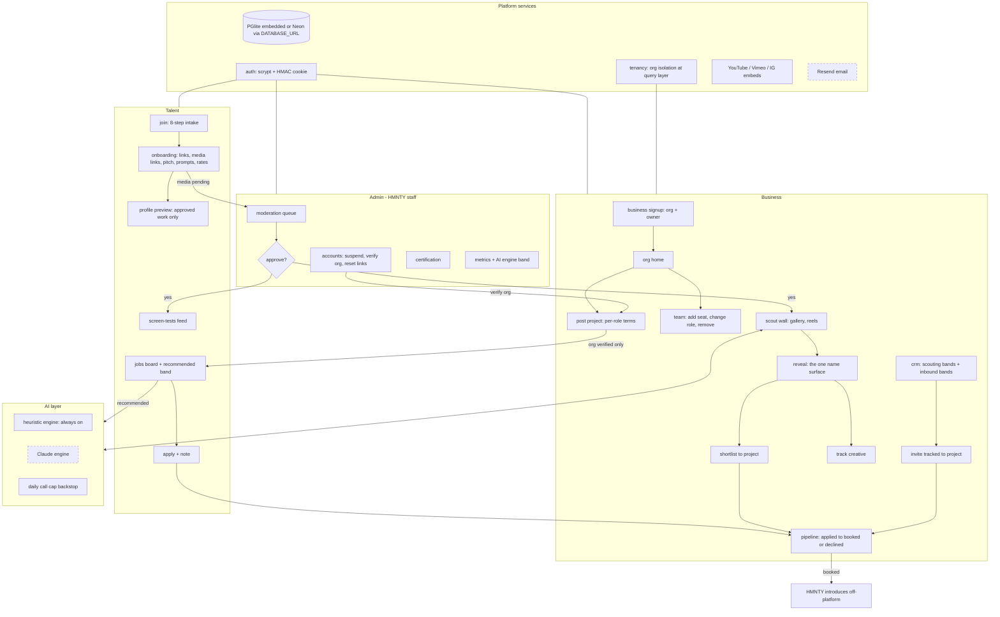
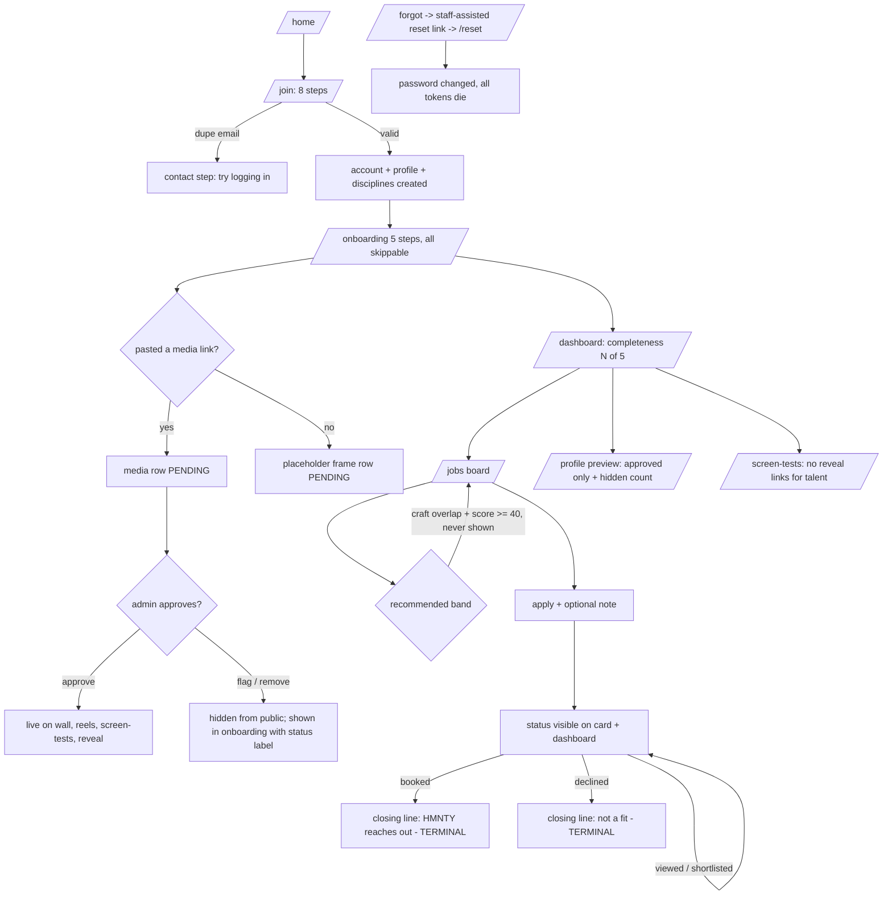
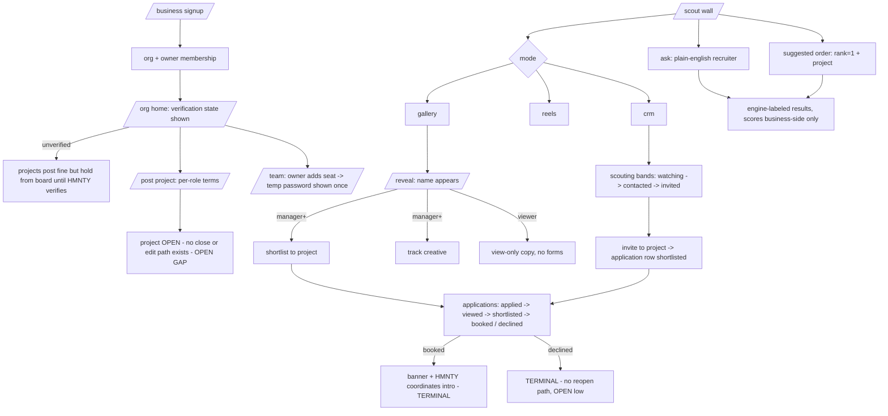
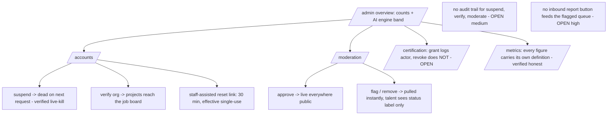
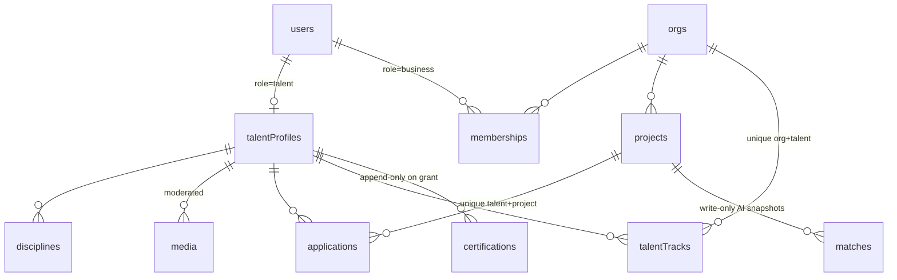

# Callsheet — Product & Engineering Audit

**Date:** 2026-08-02 · **Commit range audited:** through `197eab7` · **Method:** six parallel
read-only auditors over the full codebase (business flows, talent flows, admin/back office,
AI systems, UX quality, platform architecture) + orchestrator end-to-end reasoning, every claim
cited to file:line at audit time. 17 confirmed fixes were applied the same night and are marked
**FIXED** below; everything else is labeled **OPEN** with severity and effort.

**How to read this:** three kinds of statements appear, always labeled —
**EXISTING** (verified in code), **ASSUMPTION** (inferred, with reasoning),
**RECOMMENDATION** (proposed, not built). Absences are classified *missing* vs
*excluded by design* — the pilot deliberately excludes payments, bookings, contracts,
reviews/ratings (introductions happen off-platform via HMNTY staff), messaging/DMs,
file upload/storage (media = moderated pasted links), email until `RESEND_API_KEY`,
live Claude until `ANTHROPIC_API_KEY`, in-app notifications, business analytics,
org settings, and AI profile parsing. Treating those as "gaps" would be auditing a
different product.

---

## 1. Executive summary and direct answers

Callsheet is a three-portal pilot (Talent / Business / Admin) whose core loop —
*creative joins → registers real work by link → admin approves → business scouts a
name-blind wall → reveal → shortlist/track → pipeline to booked → HMNTY introduces
off-platform* — is **complete, walkable end to end, and internally consistent**. The
product's four laws (name-blind browsing, moderation before publish, AI suggests but
humans decide, no numeric scores talent-side) are enforced **structurally**, not by
convention: the browse data type omits names at the type level, public readers filter
approved-only in SQL, no AI code path writes to people-state, and a repo-wide sweep
found zero score renderings in the talent tree.

**Maturity, bluntly:**

| dimension | grade | one line |
|---|---|---|
| Product completeness (vs pilot spec) | **A−** | Core loop whole; profile *editing* after signup is the one real feature hole |
| Engineering | **B+** | Small, legible, defense-in-depth on mutations; zero automated tests |
| UX | **B** | Disciplined vocabulary, strong empty states; in-flight/failure feedback exists only on /join |
| Architecture | **A−** | Right-sized; clean seams (dual-driver DB, AI engine interface); known scale walls ≥ ~1k rows |
| Back office | **B** | Real levers for accounts/moderation/certification; no audit trail, no report intake |
| Docs / onboarding a new engineer | **A−** (was D) | AGENTS.md + DESIGN.md were already strong; README was boilerplate until tonight |

**The direct answers:**

- **Would I hand this to a team tomorrow?** Yes. A new engineer gets AGENTS.md
  (law + plumbing + file ownership), DESIGN.md (visual law with dated overrides), a
  real README, and this document. The codebase is ~30 routes of one consistent idiom.
- **What absolutely needed completing first?** The 17 items fixed tonight —
  above all the viewer-rank mutation hole, the unmoderated business-text path to the
  job board, and the /join dead-end loop. All landed in `197eab7`.
- **What can safely wait?** Everything in roadmap tiers 2–5 (§9). The top of tier 2
  (profile-edit epic, feedback rollout, report button) should precede any real
  user growth beyond the pilot circle.
- **Is the codebase internally consistent?** Yes — one design vocabulary, one
  plumbing path per concern (auth, tenancy, taxonomy, media), and after tonight one
  uniform permission bar per action family.
- **Is the architecture coherent?** Yes — server components + server actions only,
  no client API surface except `/api/ai/health`; the dual-driver DB is a single seam
  (`DATABASE_URL`); the AI layer is two engines behind one honest interface.
- **Is the back office complete enough to operate the platform?** For the *pilot*:
  yes (accounts, moderation, certification, org verification, metrics, AI status).
  For growth: no — it needs an audit trail, inbound reporting, and project levers
  (§6).
- **After the recommendations, ready to merge for team review?** Yes — and the
  branch is already in that state; this document is the review packet.

**Biggest strengths:** structural law enforcement; honest AI (engine labeled, facts-only
rationales, PII never leaves); moderation gate on all public media; tenancy filtered at the
query layer everywhere; the /join intake (a reference-quality form).
**Biggest open risks:** profile fields displayed/scored but never editable (availability is
*scored* yet permanently `"now"` for every real user); placeholder profiles compete with real
creatives in AI rankings; silent mutations outside /join; zero tests.

---

## 2. Product Operating Map

**EXISTING** — every node below is implemented; dashed = activates on env key.

Ownership (AGENTS.md file-ownership map): W1 talent (`app/talent`, `app/join`),
W2 business (`app/business`), W3 marketplace (`app/talent/jobs`, `app/business/scout`,
`app/screen-tests`, `components/marketplace`), W4 AI (`lib/ai`, `app/api/ai`),
W5 admin (`app/admin`), shared (`lib`, `components/ui`, layout/globals) orchestrator-owned.

---

## 3. Complete user flows

### 3.1 Talent

**Verified failure paths (EXISTING):** duplicate email → routed to contact step with
copy; invalid URL pasted → piece registers as frame, link dropped (fail closed);
suspended user → dead on next request; expired/used reset token → plain explanation.
**OPEN gaps on this flow:** refresh mid-/join loses all answers (in-memory state only);
no withdraw-application; availability/bio/city/name/disciplines have no edit surface
after signup (§8 H-1, H-4).

### 3.2 Business

**Verified (EXISTING):** org isolation held on every query traced (zero cross-tenant
paths); pipeline transitions manager+; team mutations owner-only with last-owner
protections; multi-org `?org=` context threads through scout/CRM/wall cards.
**OPEN:** no project close/edit/delete (schema has `closed`, nothing sets it);
multi-org users lose sidebar Members/New Project (`orgs.length === 1` condition);
booked → next step is off-platform by design but admin is not notified (no
notification system by design).

### 3.3 Admin

---

## 4. Platform report

**Stack (EXISTING):** Next.js 16.2.12 (App Router, server components + server
actions; Turbopack build), React 19.2.4, Tailwind v4, Drizzle ORM 0.44.2,
dual-driver DB — `@electric-sql/pglite` 0.3.6 embedded (persists `.data/`,
gitignored) or `postgres` 3.4.7 against Neon when `DATABASE_URL` is set; one env
var, no code change. `lucide-react` 1.28.0 is the only icon set (design law).
`server-only` guards server modules. No other runtime dependencies — no auth
library, no state library, no CSS framework beyond Tailwind.

**Auth (EXISTING, verified):** scrypt password hashes; HMAC-SHA256 session cookie
`{uid, exp}`, 7-day expiry, `httpOnly` + `sameSite=lax` + `secure` in prod;
timing-safe comparisons; `AUTH_SECRET` required in production (throws on Vercel
without it), dev-only fallback otherwise; email lowercased consistently at every
read/write site (join, business signup, addSeat, login, forgot — all verified);
suspension checked against the DB on **every request** (`getCurrentUser` re-reads
the user row — a suspend kills live sessions immediately); reset tokens are
stateless HMAC bound to a fragment of the current password hash — 30-minute
expiry, effective single-use (any successful reset invalidates all outstanding
tokens), no token table needed.
**Known tradeoffs (ASSUMPTION → RECOMMENDATION):** no session revocation short of
suspension (no session table — acceptable at pilot scale; add a session table when
"log out everywhere" matters); no login rate limiting (add a simple per-IP counter
before public marketing pushes); two reset links issued within one 30-minute window
are both valid until either is used (documented, low risk).

**Tenancy (EXISTING, verified):** every org-owned read/write goes through
`lib/tenancy` helpers or an explicit `orgId` SQL filter; the business-flows auditor
traced all of them and found **zero unfiltered paths**. The talent pool is
platform-wide by design; org A can see org B's *project titles* only via the shared
job board, which after tonight requires the posting org to be verified.

**Data model (EXISTING):**

**Data-model findings:** `applications` has the right unique index; `users.email`
uniquely indexed; `talentTracks` unique per org+talent. **OPEN (medium):** no
secondary indexes for the hot lookups (`media.talentId+status`,
`disciplines.talentId`, `applications.projectId`) — irrelevant at pilot row counts,
add with the first real growth; no `ON DELETE` behavior anywhere (deletes don't
happen in-product today; define before any hard-delete feature); `aiSummary` is a
dead column reserved for intake summarization (§7); `projects.draft/closed` enum
values are unreachable (no UI sets them); `matches` is write-only (documented in
code as of tonight).

**Scalability walls (EXISTING, honest numbers):** `getBrowsePool` loads every
talent profile + approved media + disciplines on each wall render; the CRM folds
disciplines in one `IN` query; recruiter/rank pre-filter by discipline in SQL then
score in memory. **ASSUMPTION:** all fine to ~1k talent rows / a few hundred
projects on Neon; beyond that the wall and pool need pagination and the rank path
needs candidate caps. Nothing here blocks the pilot.

**Error handling:** three patterns — redirect-with-`?error=` (auth flows, team,
project-create: mapped to copy), silent `return` (scout/track/admin actions —
**OPEN** UX gap §8 H-3), and throw (nothing user-facing). Global `error.tsx` and
`not-found.tsx` exist as of tonight (house style). `revalidatePath` is used on all
26 mutation sites that change rendered data.

**External surfaces:** Google Fonts at build (one transient failure observed and
retried successfully — an offline-capable `next/font/local` swap is a nice-to-have);
YouTube (`youtube-nocookie` embeds + `i.ytimg` thumbnails), Vimeo player, Instagram
embed iframes — all render inside the frame with `title` attributes; `javascript:`
and malformed URLs classify to placeholder (fail closed, verified). Planned:
Resend (email), Anthropic (AI) — both activate by env key alone. `INTRO_INBOX` is
referenced by the ops plan but **not read anywhere in code yet** (wire it with the
first Resend feature or drop it from the plan).

**CI:** install + `check:design` + `build` on every push/PR. **No automated tests
exist** (§8 M-8).

---

## 5. Back office report

**Is the admin system pilot-ready? Yes. Production-ready for growth? Not yet.**

What admins can do today (EXISTING, all verified server-side `requireUser("admin")`):

| capability | state | note |
|---|---|---|
| list/filter users | ✅ | text filter; fine to ~500 rows |
| suspend / unsuspend | ✅ | kills live sessions on next request (verified) |
| verify / unverify orgs | ✅ | **now load-bearing:** gates the job board (FIXED tonight) |
| staff-assisted reset links | ✅ | 30-min stateless tokens, suspended users excluded |
| moderate media (approve/flag/remove) | ✅ | instant effect on all public surfaces |
| certify / revoke talent | ✅ | grant logs actor; **revoke logs nothing** (OPEN) |
| metrics | ✅ | every figure self-describes; verified not misleading |
| AI engine status | ✅ | FIXED tonight: engine, key, daily-cap usage on overview |
| manage bookings / refunds / disputes / tickets | — | excluded by design (off-platform) |
| notifications, feature flags, platform settings | — | excluded by design (pilot) |
| close/remove a project | ❌ | **OPEN high** — no lever against a bad posting |
| inbound content reports | ❌ | **OPEN high** — only admins can flag, nothing feeds the queue |
| audit log (who did what when) | ❌ | **OPEN medium** — only cert grants are logged |
| fix org roles / rescue orphaned org | ❌ | OPEN medium — sole-owner-goes-dark scenario |
| feature users/jobs, impersonation | ❌ | missing; impersonation deliberately cut ("out of scope tonight" in code) |

**RECOMMENDATION — the five levers a real HMNTY staffer reaches for first** (in
order): (1) report button on reveal/wall feeding the flagged queue; (2) admin
force-close/remove project; (3) `admin_actions` append-only log (actor, action,
target, timestamp) + log the revoke path; (4) org-rescue: reassign ownership when
the sole owner is suspended/unreachable; (5) a "last AI ranking" read surface over
the `matches` table (also resolves its write-only oddity).

---

## 6. AI systems and opportunity map

**EXISTING capabilities (all verified):**

| capability | entry | engines | who sees output |
|---|---|---|---|
| Talent match ranking | scout wall "suggested order" + project | heuristic now; Claude on key, per-row fallback | business only (scores + rationales) |
| Plain-English recruiter | scout wall ASK box | parse: Claude-or-heuristic; scoring: always heuristic, labeled | business only |
| Talent recommendations | jobs board band | heuristic only | talent (never a number) |
| Engine health | `GET /api/ai/health` + admin band | — | staff |

**Verified law compliance:** zero numeric scores anywhere talent-side (repo-wide);
AI never writes to applications/tracks (only humans trigger those actions);
rationales cite only computed facts; PII (email/phone/bio/prompts) never reaches
the Claude payload — the injection surface via profile text is **closed by
omission**, and the code now documents that adding bio to the payload would reopen
it. Model id `claude-sonnet-5` verified real and current. Cost: `MAX_TOKENS` 1024,
20s timeout, and (FIXED tonight) a daily call cap with heuristic fallback —
**the real budget number is a human decision for Omar + founders before heavy use.**

**Known ranking pathologies (OPEN, documented honestly):**
- **Placeholders rank as equals** (high): `isPlaceholder` is invisible to
  ranking/recruiter/recommendations. All 12 seeded creatives compete with real
  signups. **Decision needed before real creatives are widely ranked** —
  recommended: exclude placeholders from AI candidate pools once ≥N real profiles
  exist, keep them browsable on the wall.
- **Specialist penalty** (medium): coverage scores a candidate against a project's
  *entire* role bundle, so a pure Editor caps at half the discipline points on a
  DP+Editor project while a generalist takes full credit. Fix: score against the
  best-fit single role.
- **Availability is a dead scoring term for real users** (consequence of the
  missing edit surface, §8 H-1): every real profile is permanently `"now"`.

**RECOMMENDATION — opportunity map (each hooks into existing seams, all
suggest-only):**

| idea | hook | value | effort | priority |
|---|---|---|---|---|
| Intake summarization → `aiSummary` (column already exists) | /join transcript → profile summary on reveal | reveal reads richer with zero talent effort | M | next |
| Link-metadata enrichment (oEmbed title/duration on pasted media) | `lib/media.ts` classify step | auto-titles, dead-link detection, moderation context | M | next |
| Moderation assist (pre-screen link metadata + text for the queue) | admin moderation list | faster, safer approvals as volume grows | M | next |
| Role-terms drafting help on project post | new-project form | better briefs in, better matches out | S | later |
| Rationale caching via `matches` read path | scout + admin | cheaper repeat ranks + audit surface | S | later |
| Semantic search over profiles/briefs (embeddings) | recruiter | post-pilot quality jump | L | later |
| Admin anomaly flags (duplicate portfolios, spam links) | admin | trust & safety at scale | L | later |

---

## 7. Verified clean — what the audit affirms

These were **checked and hold** (not assumed): tenant isolation on every traced
query; name-blindness structural at the type level; moderation approved-only on
every public reader (wall, reels, screen-tests, reveal); no-scores-talent-side
absolute; AI never mutates people-state; suspension = live kill; reset tokens
sound; admin actions all re-derive the caller; email normalization consistent;
placeholder labeling never dropped; design vocabulary near-zero drift; empty
states with next actions almost everywhere; programmatic form labels, iframe
titles, focus outlines, AA contrast on both text tones; /join's pending/error
instrumentation (the reference implementation for §8 H-3); metrics figures honest
to their own definitions.

---

## 8. Gap report (post-fix state)

**FIXED tonight (`197eab7`):** viewer-rank could mutate pipeline/watchlist (now
manager+, UI aligned) · unverified-org text published to every talent (job board
now verified-orgs-only, with honest business-side copy + pre-verified seed) ·
/join dead-end loop for logged-in users (redirect + honest "set at signup"
affordance) · profile preview showed removed/flagged work as live (approved-only
+ hidden count) · wall cards dropped `?org=` (threaded) · screen-tests dead-end
for talent (role-aware cards) · booked/declined closure copy both sides · geo
copy distinguishes unrecognized city · mixed-engine batch label honesty · AI
daily-cap backstop + health/admin surfacing · matches documented write-only ·
project detail → pre-scoped ranking link · one-primary law on login/forgot/reset ·
error.tsx + not-found.tsx · README rewritten as a real runbook · law-guard
comment on the wall's Match usage.

**OPEN — ranked:**

| # | sev | finding | recommendation | effort |
|---|---|---|---|---|
| H-1 | HIGH | Profile fields displayed/scored but never editable: `availability`/`availableFrom` (scored 8pts, permanently "now"), `bio` (reveal reads it, always null), `city`/`displayName`/travel (set once at join), disciplines (frozen) | One "profile editing" epic: availability step in onboarding first (status + from-date), then bio, then city/name/travel, then a real disciplines editor (insert+delete reconciliation) | M–L |
| H-2 | HIGH | Placeholders compete in AI rankings (`isPlaceholder` invisible to `lib/ai`) | Product decision, then: exclude from candidate pools when real profiles exist (keep on wall) | S–M |
| H-3 | HIGH | Zero in-flight/failure feedback outside /join; scout/admin actions fail with silent `return` | Roll the /join pattern out: `useFormStatus` pending on ~15 forms; guard-clause `return` → `redirect(?error=)` + one-line copy per page | M |
| H-4 | HIGH | No project close/edit/delete (business or admin) | Manager close action (status→closed, drops off board + pickers) + admin force-close | M |
| H-5 | HIGH | No inbound report mechanism (flagged queue has no funnel) | "Report" text action on reveal/cards → flags media (or a reports table) into the existing queue | S |
| H-6 | HIGH | /join loses all state on refresh (in-memory only) | sessionStorage draft persistence keyed per step | M |
| M-1 | MED | No admin audit trail; cert revoke logs nothing | `admin_actions` append-only table + write on all admin mutations | M |
| M-2 | MED | No withdraw-application for talent | `withdrawApplication` action + text link, pre-terminal statuses only | S |
| M-3 | MED | Six destructive actions are one-click, no confirm (delete media, remove seat, stop tracking, remove media, suspend, decline) | Inline two-step confirm (client toggle), fits the design language | S–M |
| M-4 | MED | Multi-org users lose sidebar Members/New Project | Read `?org=`/last-org in the layout; stop gating on `orgs.length === 1` | S |
| M-5 | MED | Specialist penalty in coverage math (whole-bundle vs best role) | Score per best-fit role; keep bundle coverage as tiebreak | M |
| M-6 | MED | Geocoder = 14-city table; unknown city silently nulls distance | Real geocoding API post-pilot; copy already honest (fixed) | M |
| M-7 | MED | Admin ergonomics at scale: no pagination anywhere; two-admin races last-write-wins silently | Paginate lists at ~100+ rows; `WHERE status = expected` guards on admin updates | M |
| M-8 | MED | Zero automated tests; CI = design gate + build | Highest-value first: tenancy/permission integration tests (viewer vs manager vs owner per action), recruiter/media-classifier units (pure functions), then a Playwright smoke of the three-portal walk | M |
| M-9 | MED | Admin cannot rescue an org (sole owner dark) or add staff in-product | Admin reassign-ownership action; document the manual staff-add path | S–M |
| L-1 | LOW | Talent cannot see own `certStatus` | Read-only fact on profile when not "none" | S |
| L-2 | LOW | "Verified" not shown to talent on project cards (implied by board presence) | Optional `verified` fact on ProjectCard | S |
| L-3 | LOW | Application transitions have no undo (terminal by design) | Admin-side override or short undo window, someday | M |
| L-4 | LOW | 11px tracked-caps floor on dense screens; em-dash-as-null glyph (8 sites) | Both are product-owner taste calls, flagged not fixed | S |
| L-5 | LOW | `aiSummary` dead column; `INTRO_INBOX` unread; draft/closed enum values unreachable | Each resolves with its owning roadmap item | — |

---

## 9. Prioritized roadmap

1. **Before team review** — ✅ done tonight: the 17 fixes + README + this document.
2. **Before real-user growth (next)** — H-1 (availability first), H-3, H-5, H-2
   decision, H-4, H-6; DB-backed AI usage counter replacing the in-memory cap;
   AI budget number decided by Omar + founders.
3. **Next sprint** — M-1, M-2, M-3, M-4, M-9, L-1, L-2; first test suite (M-8:
   tenancy/permissions integration + pure-function units).
4. **Short-term** — M-5, M-6, M-7; matches read surface; intake summarization +
   link enrichment + moderation assist (the three next AI features).
5. **Long-term** — real uploads/storage, notifications + messaging (Resend first),
   org settings, business analytics, embedding search, session table + rate
   limiting, Playwright E2E in CI.

## 10. Closing assessment

This is a coherent, honest, law-abiding pilot codebase whose main risk is not what
it does but what users cannot yet *change* (their own profiles) and what operators
cannot yet *see* (an audit trail) or *receive* (reports). None of that blocks a
team review; all of it is ranked above. The product does what it says on every
surface we could verify, and where it doesn't yet, it now says so out loud.

*Generated by the 2026-08-02 audit run: six parallel auditors + orchestrator
synthesis; ~1.7M tokens of evidence; every finding carried a file:line citation at
audit time. The platform-architecture auditor stalled and its territory was
re-covered manually by the orchestrator (§4).*
